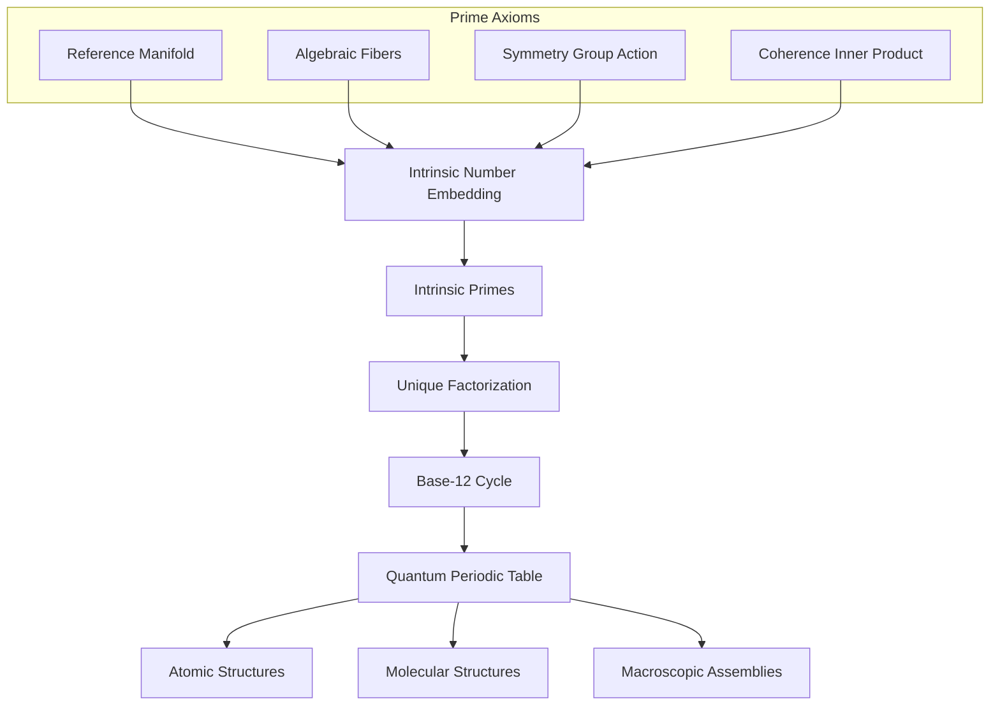

# Prime Model with Periodic Table

## Abstract
This document presents a comprehensive mapping from the Prime Axioms to the emergence of atomic, molecular, and higher‐order structures. In the Prime Framework, natural numbers are intrinsically embedded in local fiber algebras, leading to the definition of intrinsic primes and their unique factorization. These fundamental constructs give rise to a quantum periodic table—a structured “table of quanta” that not only reproduces the elements of the Standard Model but also extends it with new emergent phenomena. While insights from quantum biology (e.g. coherence and self‐organization) inspire this approach, they serve solely as an inspirational framing rather than a formal component of the model.

## 1. Introduction
The Prime Framework unifies geometry, algebra, and symmetry to construct physical reality from first principles. Starting with a smooth reference manifold and local algebraic fibers (typically Clifford algebras), the framework defines numbers through an intrinsic embedding. This process yields intrinsic primes and a unique factorization theorem analogous to classical arithmetic. These quantum elements are organized into a periodic table—mirroring the structure of the Standard Model and extending it to include higher‐order assemblies from atoms and molecules to macroscopic structures.

## 2. The Prime Axioms and Their Emergent Roles
The foundation of the Prime Framework rests on four core axioms:

1. **Reference Manifold:**  
   A smooth, connected, and orientable manifold \( M \) equipped with a nondegenerate metric \( g \) provides the geometric arena.  

2. **Algebraic Fibers:**  
   At each point \( x \in M \), an associative algebra \( C_x \) (typically a Clifford algebra) encodes the local algebraic structure, enabling intrinsic embedding of numbers.  

3. **Symmetry Group Action:**  
   A Lie group \( G \) acts by isometries on \( M \) and lifts to the fibers \( C_x \), ensuring consistency of local representations under transformation.  

4. **Coherence Inner Product:**  
   Each fiber \( C_x \) is endowed with a \( G \)-invariant, positive-definite inner product that selects the unique, minimal-norm (canonical) representation for each embedded object.  

## 3. Mapping Prime Axioms to Quantum Elements

The following table summarizes the contribution of each Prime Axiom to the emergence of quantum elements and their correspondence with extended aspects of the Standard Model:

| **Prime Axiom**             | **Description**                                                                 | **Emergent Quantum Element / Structure**                                                                                                          | **Extended Standard Model Aspect**                                                        |
|-----------------------------|---------------------------------------------------------------------------------|-----------------------------------------------------------------------------------------------------------------------------------------------------|-------------------------------------------------------------------------------------------|
| **Reference Manifold**      | A smooth manifold \( M \) providing the geometric background.                   | Establishes the spatial arena; geometric lensing yields coherent resonant wave patterns that form the basis of quantum states.                     | Underpins the space-time fabric for gauge fields and fermions.                           |
| **Algebraic Fibers**        | Local Clifford algebras \( C_x \) encoding algebraic data.                      | Enables intrinsic number embedding and the formation of intrinsic primes; constitutes the algebraic “DNA” of quantum elements.                        | Framework for spinor representations and quantum numbers (e.g., Dirac matrices).            |
| **Symmetry Group Action**   | A Lie group \( G \) acting by isometries on \( M \) and \( C_x \).                | Enforces gauge invariance and consistent transformation properties, naturally classifying quantum elements.                                        | Corresponds to the gauge groups \( SU(3) \times SU(2) \times U(1) \) in the Standard Model.|
| **Coherence Inner Product** | A \( G \)-invariant inner product selecting minimal-norm representations.        | Filters out decoherent representations to yield stable quantum elements (e.g., the 12 base states in a periodic cycle) and unique factorization.  | Ensures anomaly cancellation and uniquely determined particle configurations.             |

## 4. From Intrinsic Embedding to the Quantum Periodic Table
Within the framework, natural numbers are constructed by encoding their digit expansions (in every base \( b \ge 2 \)) into the fiber algebra \( C_x \). The coherence inner product forces these multi-base representations to agree, producing a unique canonical element \( \widehat{N} \) for each number. This intrinsic embedding leads to:
- **Intrinsic Primes:** Embedded numbers that do not factor nontrivially.
- **Unique Factorization:** Every number factors uniquely into intrinsic primes.
- **Base-12 Cycles:** A natural 4×3 arrangement of states (12 elements) emerges, paralleling the structure seen in the Standard Model (e.g., 12 fermions or gauge bosons) and extending it.

## 5. Visualizing the Framework

### 5.1 Flowchart of the Prime Framework
The following mermaid diagram illustrates how the Prime Axioms lead to intrinsic embedding, factorization, and the eventual formation of a quantum periodic table.

### 5.2 The Periodic Table of Quanta
Below is a conceptual grid resembling the periodic table. Each cell represents one of the 12 fundamental quantum elements emerging from the base-12 cycle. These elements extend the Standard Model by incorporating both known particle families and new, emergent quantum states.

```mermaid
flowchart TD
    subgraph Row1 [Row 1: Fundamental Fermions]
      Q1[Q1: Up-type Fermion]
      Q2[Q2: Down-type Fermion]
      Q3[Q3: Electron-like Fermion]
      Q4[Q4: Neutrino-like Fermion]
    end
    subgraph Row2 [Row 2: Gauge Bosons]
      Q5[Q5: Photon-like Boson]
      Q6[Q6: W Boson-like]
      Q7[Q7: Z Boson-like]
      Q8[Q8: Gluon-like]
    end
    subgraph Row3 [Row 3: Extended Quantum States]
      Q9[Q9: Extended Element 1]
      Q10[Q10: Extended Element 2]
      Q11[Q11: Extended Element 3]
      Q12[Q12: Extended Element 4]
    end

    %% Arrange nodes horizontally in each row
    Q1 --- Q2 --- Q3 --- Q4
    Q5 --- Q6 --- Q7 --- Q8
    Q9 --- Q10 --- Q11 --- Q12
```

*Note: The labels provided (e.g., "Up-type Fermion", "Photon-like Boson") are illustrative and indicate the mapping of the intrinsic quantum elements to known particle properties in the Standard Model, while the "Extended Quantum States" represent additional elements predicted by the internal consistency of the Prime Framework.*

## 6. Higher-Order Structures: Atoms, Molecules, and Beyond
The intrinsic quantum elements are the building blocks for more complex structures:
- **Atomic Structures:**  
  Coherent superpositions of base-12 states generate atomic orbitals, leading to the familiar periodic table of chemical elements.
- **Molecular Structures:**  
  Atoms combine through quantum bonding rules, forming molecules with modular and repeating patterns reflective of the underlying periodicity.
- **Macroscopic Assemblies:**  
  The same organizing principles scale upward, suggesting that the fractal-like repetition of quantum patterns governs structures at all levels.

## 7. Conclusion
The Prime Model with its Periodic Table of Quanta offers a unified, self-contained framework that maps the Prime Axioms to a hierarchical structure of reality—from intrinsic quantum elements up through atoms, molecules, and complex assemblies. By deriving numbers intrinsically, defining intrinsic primes, and employing a unique factorization theorem, the framework not only mirrors the structure of the Standard Model but also extends it, predicting new and emergent phenomena. This holistic approach underscores the deep interconnections between geometry, algebra, and symmetry in the architecture of the natural world.

